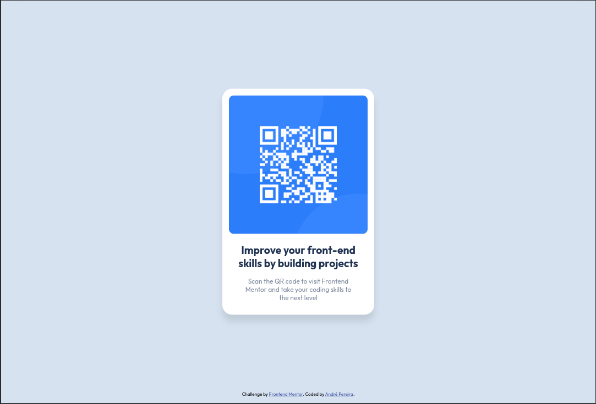
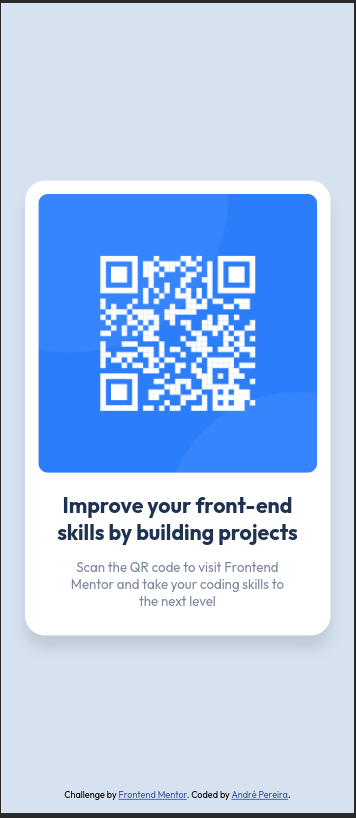

# Frontend Mentor - QR code component solution

This is a solution to
the [QR code component challenge on Frontend Mentor](https://www.frontendmentor.io/challenges/qr-code-component-iux_sIO_H).
Frontend Mentor challenges help you improve your coding skills by building realistic projects.

## Table of contents

- [Overview](#overview)
    - [Screenshot](#screenshot)
    - [Links](#links)
- [My process](#my-process)
    - [Built with](#built-with)
    - [Useful resources](#useful-resources)
- [Author](#author)

## Overview

### Screenshots

#### Desktop

#### Mobile

### Links

- Solution
  URL: [Add solution URL here](https://www.frontendmentor.io/solutions/mobilefirst-solution-using-flexbox-and-new-builtin-css-nesting-yAewfn9MpS)

- Live Site URL: [GitHub Pages](https://dre1597.github.io/fm-qr-code-component/)

## My process

### Built with

- Semantic HTML5 markup
- CSS custom properties
- Flexbox
- Mobile-first workflow

### Useful resources

- [Reset CSS](https://meyerweb.com/eric/tools/css/reset/)

## Author

- Frontend Mentor - [@dre1597](https://www.frontendmentor.io/profile/dre1597)
- LinkedIn - [@dre1597](https://www.linkedin.com/in/dre1597/)

